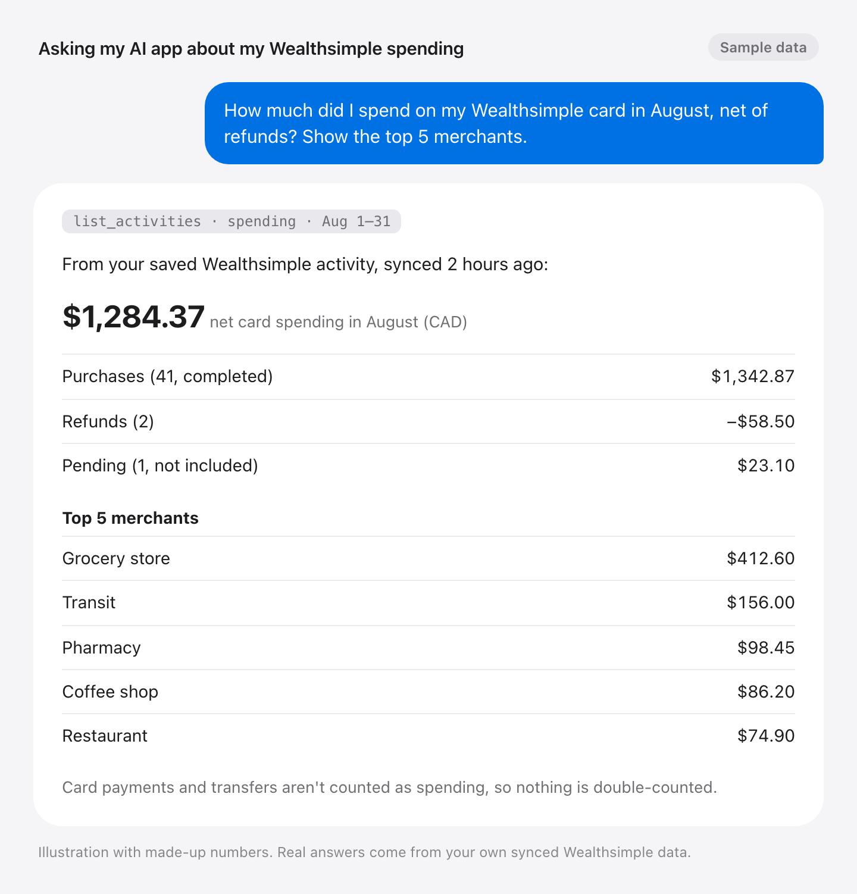
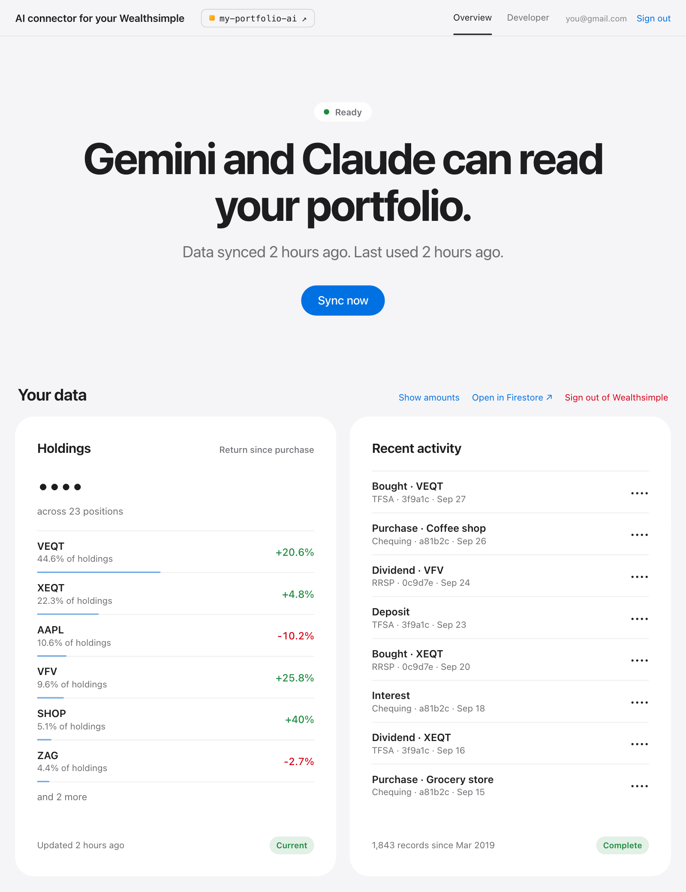
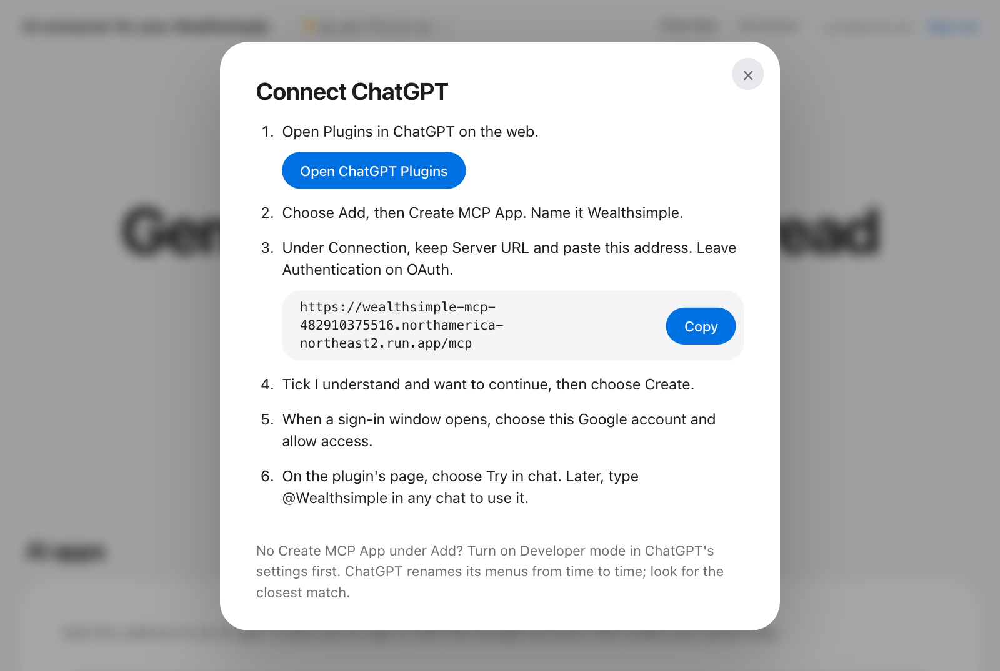
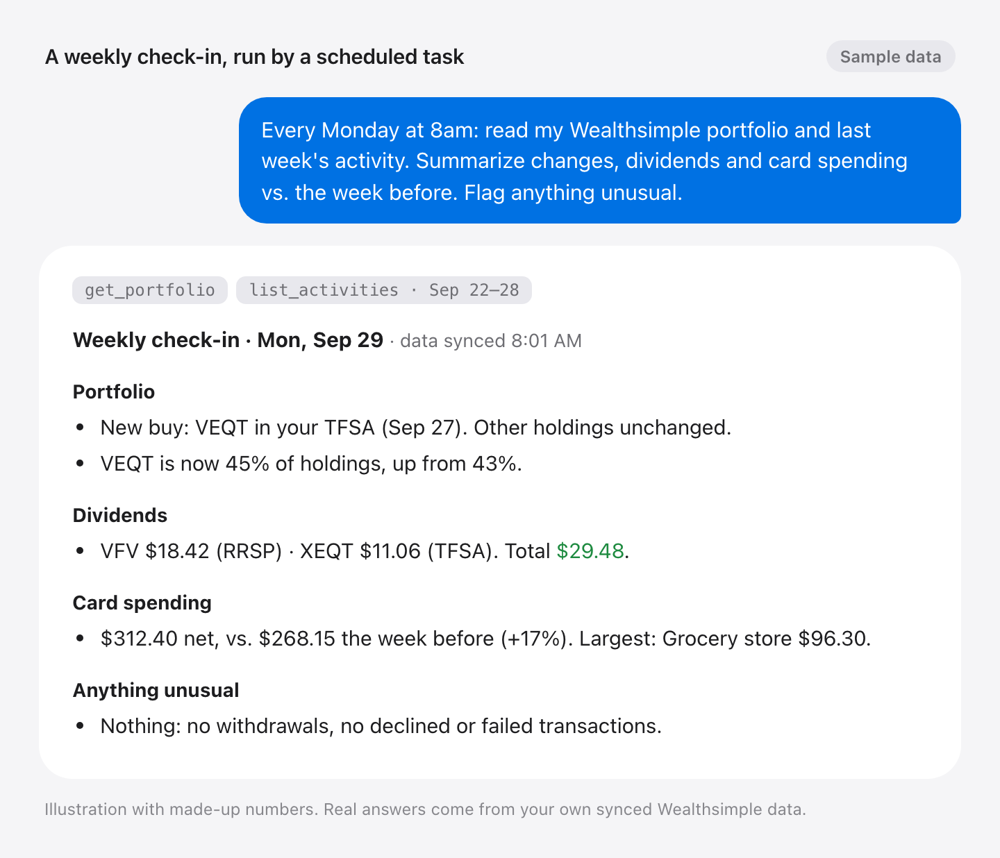
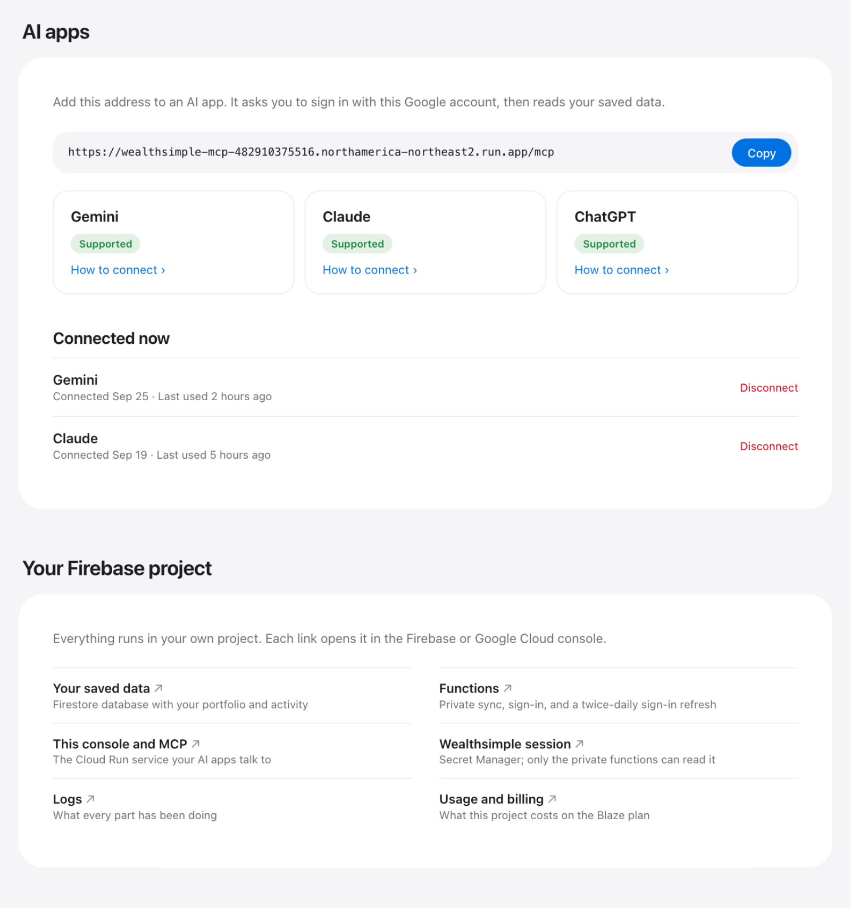
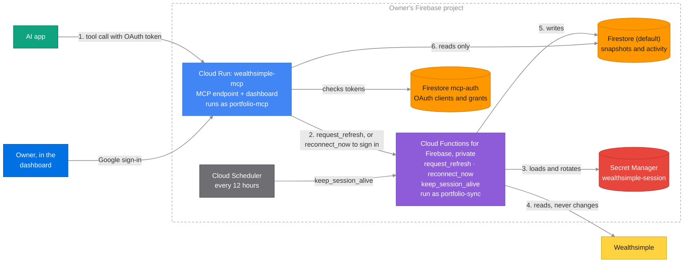

# Private AI connector for your Wealthsimple

Ask Gemini, Claude or ChatGPT about your Wealthsimple portfolio and activity,
from a private connector that runs in your own Firebase project.

- **Yours alone.** Each person deploys their own copy into their own Firebase
  project. Your data goes from Wealthsimple to your project to the AI app you
  connect, and nowhere else: there is no shared server, and the developer
  never sees it.
- **Read-only.** The AI gets three read tools. There is no trading, transfer or
  any other tool that changes your Wealthsimple accounts.
- **One page to manage it.** The dashboard shows your holdings, recent
  activity and connected AI apps, and is where you sign in to Wealthsimple.

A simulated example, with made-up numbers:

<picture>
  <source media="(prefers-color-scheme: dark)" srcset="docs/images/example-spending-dark.png">
  
</picture>

<picture>
  <source media="(prefers-color-scheme: dark)" srcset="docs/images/overview-dark.png">
  
</picture>

This project is unofficial and not affiliated with Wealthsimple. It reads
Wealthsimple through the same private APIs its web app uses, which can change
without notice. Wealthsimple is a trademark of Wealthsimple Technologies Inc.

## Why this exists

I wanted to ask my AI app about my whole portfolio, not just part of it. Some
brokers, such as Interactive Brokers, offer an official connector for that, but
Wealthsimple doesn't.

Third-party platforms such as SnapTrade and BankSync can fill the gap, but they
charge a subscription, and I don't trust them with my Wealthsimple sign-in,
which can do far more than read. So I made this open source instead, for anyone
to run their own copy.

## How to use

### 1. Create a Firebase project

[Create a new project](https://console.firebase.google.com/) and upgrade it to
the Blaze plan. For one person, it stays within the no-cost tier.

### 2. Run the setup

Click this button. It opens Google Cloud Shell with a setup guide on the right.

[](https://shell.cloud.google.com/cloudshell/editor?cloudshell_git_repo=https://github.com/induction-axiom/ai-connector-for-your-wealthsimple&cloudshell_git_branch=stable&cloudshell_tutorial=docs/cloudshell-tutorial.md&show=terminal)

When Cloud Shell asks, tick **Trust repo**. Then follow the guide. It takes
about 10 minutes and ends with your dashboard link. Bookmark it.

If the guide doesn't open, the download from GitHub was interrupted. In the
terminal, press ↑ then Enter to try again.

### 3. Sign in to Wealthsimple

Open the dashboard, sign in with Google, then sign in to Wealthsimple.

### 4. Connect your AI app

In the dashboard: **AI apps** → your app → **How to connect**.

<picture>
  <source media="(prefers-color-scheme: dark)" srcset="docs/images/connect-chatgpt-dark.png">
  
</picture>

Then just ask. A scheduled task in your AI app can also send you a weekly
check-in (simulated, with made-up numbers):

<picture>
  <source media="(prefers-color-scheme: dark)" srcset="docs/images/example-weekly-checkin-dark.png">
  
</picture>

## What gets created

Everything lives in your Firebase project, and the dashboard links each piece:

<picture>
  <source media="(prefers-color-scheme: dark)" srcset="docs/images/apps-and-cloud-dark.png">
  
</picture>

## Later

- **Lost the dashboard link?** Ask your AI app for it.
- **Updating.** The dashboard shows a banner when a new version is out. Click
  **How to update**. Your data and connections stay.
- **Removing it.** Disconnect your AI apps in the dashboard, then delete the
  Firebase project (**Project settings → General → Delete project**). That
  deletes everything, including your saved data.

## How your data is handled

Your connector reads Wealthsimple when your AI app asks, saves the result in
your project, and answers from that copy. Only your connector and your Google
account can read it. Your Wealthsimple password is never stored.

The AI gets three read-only tools: `get_data_status`, `get_portfolio` and
`list_activities`. Account numbers are never shared with it.

## Development

```text
firebase/
  functions/   Private sync, reconnect, sign-in keep-alive
  mcp/         OAuth MCP server, saved-data readers, dashboard
  scripts/     bootstrap.sh, manage.py (bootstrap, deploy, doctor, urls)
src/wealthsimple_connector/core/   Wealthsimple client; deploy copies it into functions/ and mcp/
tests_cloud/  tests_mcp/  tests_deployment/
docs/cloudshell-tutorial.md        The Cloud Shell guide
```

Deploy one part after a change, then check the access boundaries:

```sh
python3 firebase/scripts/manage.py deploy --target mcp --project YOUR_PROJECT_ID
python3 firebase/scripts/manage.py doctor --project YOUR_PROJECT_ID
```

### Architecture



A tool call, step by step:

1. The AI app calls `/mcp` on Cloud Run with an OAuth token the owner approved
   once with Google.
2. Cloud Run calls `request_refresh`. Only the `portfolio-mcp` identity may
   invoke the functions; anonymous requests get 401 or 403.
3. The function loads the session from Secret Manager. Of the two runtime
   identities, only `portfolio-sync` has access to it.
4. It reads the accounts from Wealthsimple.
5. It writes the snapshot or activity to the `(default)` database.
6. Cloud Run reads it back (`portfolio-mcp` has read-only access there) and
   answers.

Resource names are fixed in `firebase/scripts/configuration.py`. Nothing is
saved locally: `manage.py` finds the deployed `wealthsimple-mcp` service and
reads its region, owner and Firebase config from it.

## License

Copyright (C) 2026 Jong Luo. Licensed under the GNU Affero General Public
License v3.0 only (AGPL-3.0-only). See [LICENSE](LICENSE).
